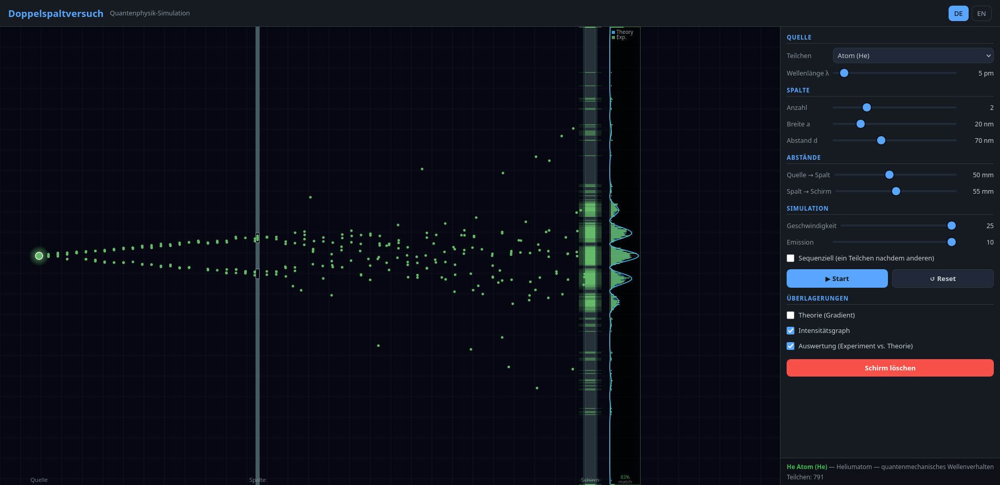

# Doppelspaltversuch - Double-Slit Experiment Simulator

> An interactive web-based simulation of the famous double-slit experiment, demonstrating quantum mechanical principles and the wave-particle duality of light and matter.

[](https://doofmars.github.io/doppelspaltversuch/)

## Overview

The double-slit experiment is a fundamental demonstration in quantum mechanics that reveals the strange behavior of particles at the quantum scale.
This project provides an interactive, educational simulation where you can observe how particles behave differently when observed versus unobserved.

**Try it online:** [Visit the live demo](https://doofmars.github.io/doppelspaltversuch/) to experiment with different particle types, slits, and configurations in real-time.

## Features

- **Multiple Particle Types:** Simulate photons, electrons, protons, neutrons, helium atoms, classical balls, and paint spray
- **Interactive Controls:** Adjust slit width, number of slits, particle energy, wavelength, and observation settings
- **Real-time Visualization:** Watch particles create interference patterns on the detection screen
- **Quantum Observation Mode:** Toggle wave-function collapse to demonstrate the observer effect
- **Bilingual Interface:** Full support for German (Deutsch) and English
- **Responsive Design:** Works on desktop and mobile devices
- **Physics-Based Engine:** Realistic diffraction, interference, and particle behavior simulation

## Getting Started

### Prerequisites
- A modern web browser (Chrome, Firefox, Safari, Edge)
- No server or build tools required – pure vanilla JavaScript

### Installation

1. Clone or download this repository:
```bash
git clone https://github.com/doofmars/doppelspaltversuch.git
cd doppelspaltversuch
```

2. Open `index.html` in your web browser, or serve it locally:
```bash
# Using Python 3
python -m http.server 8000

# Using Node.js (with http-server)
npx http-server
```

3. Open your browser to `http://localhost:8000`

## How to Use

### Basic Operation
1. **Select a Particle Type:** Choose from the dropdown menu in the Source section
2. **Adjust Parameters:** Modify slit width, wavelength, particle energy, etc.
3. **Toggle Observation:** Enable/disable the detector to see the observer effect
4. **Watch the Pattern:** Observe how particles create an interference or diffraction pattern on the right screen

### Control Panel

- **Source Section**
    - Particle Type: Select the particle to simulate
    - Wavelength/Energy: Adjust the de Broglie wavelength or kinetic energy
    - Particle Rate: Control how frequently particles are emitted

- **Slit Section**
    - Number of Slits: 1, 2, 3, or 4 slits
    - Slit Width: Adjust the width of each slit opening
    - Slit Separation: Control distance between slits

- **Observation Section**
    - Toggle Detection: Enable observation to trigger wave-function collapse
    - Clear Screen: Reset the current detection pattern

- **Display Options**
    - Color Scheme: Choose different visualization modes
    - Language: Switch between German and English

## Supported Particle Types

| Particle | Mass | Charge | Notes |
|----------|------|--------|-------|
| **Photon** | 0 | 0 | Pure wave behavior, no rest mass |
| **Electron** | ~0.511 MeV | -1e | Fundamental particle, strong quantum effects |
| **Proton** | ~938 MeV | +1e | Found in atomic nuclei |
| **Neutron** | ~939 MeV | 0 | Found in atomic nuclei |
| **Helium Atom** | ~3.7 GeV | 0 | Composite particle, wave interference observed |
| **Ball** | Classical | 0 | Classical object for comparison |
| **Paint Spray** | Classical | 0 | Demonstrates classical particle behavior |

## Physics Concepts Demonstrated

- **Wave-Particle Duality:** See how particles exhibit both wave-like (interference) and particle-like (detection) properties
- **Diffraction:** Single-slit diffraction patterns show bending of waves around obstacles
- **Interference:** Multi-slit patterns demonstrate constructive and destructive interference
- **Quantum Observation Effect:** Toggling detection shows how measurement collapses the wave function
- **de Broglie Wavelength:** λ = h/p (adjusting energy changes the associated wavelength)

## Project Structure

```
doppelspaltversuch/
├── index.html           # Main HTML structure
├── css/
│   └── style.css        # Styling and layout
├── js/
│   └── app.js           # Physics engine, simulation, and UI logic
├── locales/
│   ├── de.json          # German translations
│   └── en.json          # English translations
└── README.md            # This file
```

## Technical Stack

- **Frontend:** HTML5, CSS3, Vanilla JavaScript (ES6+)
- **Graphics:** HTML5 Canvas API for rendering
- **Physics:** Custom physics engine implementing:
    - Quantum mechanics (wave functions, diffraction)
    - Particle propagation with realistic physics
    - Interference pattern calculation
- **Internationalization:** Custom i18n system supporting multiple languages

## Language Support

The application is fully internationalized and supports:
- **Deutsch (de)** - German
- **English (en)** - English

Language preferences can be toggled via the language buttons in the header.

## Customization

You can modify simulation parameters by editing the constants at the top of [js/app.js](js/app.js):

```javascript
const MAX_HITS         = 50000; // Maximum stored hits
const GLOW_ALPHA       = 0x55;  // Glow transparency
const INTENSITY_SCALE  = 2.0;   // Screen brightness multiplier
```

## Learning Resources

- **Wikipedia:** [Double-slit experiment](https://en.wikipedia.org/wiki/Double-slit_experiment)
- **PBS Space Time:** Double slit experiment explained
- **Interactive Physics:** This simulation helps visualize quantum behavior interactively

## Contributing

Contributions are welcome! Feel free to:
- Report bugs by opening an issue
- Suggest new features or improvements
- Submit pull requests with enhancements
- Translate to additional languages

## License

This project is open source. Refer to the LICENSE file for details on usage and distribution.

## Acknowledgments

Inspired by educational demonstrations of quantum mechanics and the famous double-slit experiment by Thomas Young and later quantum physicists.

---

**Last Updated:** March 2026
